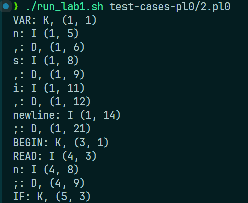

# 实验1：词法实验

:man_student: Charles

## 实验概述

借助flex工具实现一个词法分析器，将SysY代码中的单词和符号进行分类，然后按照单词符号出现顺序依次输出：原始单词符号、种类、出现在源程序的位置（行数和列数）。

> 本次实验选择对 **pl0** 代码进行词法分析

## 实验过程

### 构建测试代码

由于选择采用pl0，需要先将测试用例的 `.sy` 文件转化为对应的 `.pl0` 形式。例如， `src/test-cases/1.sy` ：

```assembly
int main(){
    int b[10][10][10],a;
    b[2][2][2]=010;
    int test=21474836472147483647;
    int test=0xabcde;
    int 666bbb666;
    int aaa111aaa;
    a=b[2][2][2];
    while(a>0){
        a=a-1;
        if(a==5)
            break;
    }
    return a;
}
```

“翻译”为对应的 `1.pl0` 如下：

```assembly
VAR a, b, test, 666bbb666, aaa111aaa; // pl0不支持数组，变量全为int

BEGIN
  b := 010;
  test := 21474836472147483647
  test := 0xabcde
  a := b
  WHILE a > 0 DO
  BEGIN
    a := a - 1;
    IF a = 5 THEN        
      a := 0; // pl0没有break，通过设置a=0终止循环
  END;
END.
```

> pl0语言不支持注释，此处的注释仅用于该文档，实际代码中无注释。

`test-cases/` 中的6个测试文件也都改写为了 `.pl0` 语法，详见附件中 `test-cases-pl0/` 。

### 编写 `flex` 程序

设计不同正规式识别不同类别的单词符号：

- 关键字：pl0语言的保留关键字

  ```c
  const char* Ks[] = {
    "CONST", "VAR", "PROCEDURE", "IF", "THEN", "BEGIN", "END", "WHILE", "DO", "CALL", "ODD", "RAED", "WRITE", NULL
  };
  
  int isK(char* str) {
    for (int i = 0; Ks[i] != NULL; i++) {
      if (strcmp(Ks[i], str) == 0) {
        return 1;
      }
    }
    return 0;
  }
  ```

- 标识符：由字母和数字构成，且开头不能为数字

  ```c
  // token {letter}({digit}|{letter})*
  {token}
  ```

- 常量：由数字构成

  ```c
  // digit [0-9]
  {digit}+
  ```

- 算符：pl0语言的合法算符

  ```c
  // operator [+*/=<>-]
  "<>"|"<="|">="|{operator}
  ```

- 界符：pl0语言的合法界符

  ```c
  // delimiter [;,.()]
  ":="|{delimiter}
  ```

- 其他：不符合上述规则的（语法错误）。比如以数字开头的非法变量名：

  ```c
  {digit}+{token}
  ```

记录每个单词符号的位置（行数和列数）：

- 行数由 `flex` 自带的 `yylineno` 维护

  ```c
  %option yylineno
  extern int yylineno;   
  ```

- 列数由自定义的 `yycolno` 维护

  ```c
  int yycolno = 1;
  ```

  每次处理完单词符号后，将 `yycolno` 加上该单词符号的长度 `yyleng` 。

整体代码 `lab1.l` 如下：

```c
%option noyywrap
%option yylineno
%{

#include <stdio.h>
#include <stdlib.h>
#include <string.h>

extern int yylineno;   
int yycolno = 1;

const char* Ks[] = {
  "CONST", "VAR", "PROCEDURE", "IF", "THEN", "BEGIN", "END", "WHILE", "DO", "CALL", "ODD", "RAED", "WRITE", NULL
};

int isK(char* str) {
  for (int i = 0; Ks[i] != NULL; i++) {
    if (strcmp(Ks[i], str) == 0) {
      return 1;
    }
  }
  return 0;
}

%}

digit [0-9]
letter [a-zA-Z]
token {letter}({digit}|{letter})*
delimiter [;,.()]
operator [+*/=<>-]


%%

\n {
  yycolno = 1;
}

[ \t]+ {
  yycolno += yyleng;
}

{token} {
  if (isK(yytext)) {
    printf("%s: K, (%d, %d)\n", yytext, yylineno, yycolno);
  } else {
    printf("%s: I (%d, %d)\n", yytext, yylineno, yycolno);
  }
  yycolno += yyleng;
}

{digit}+ {
  printf("%s: C, (%d, %d)\n", yytext, yylineno, yycolno);
  yycolno += yyleng;
}

":="|{delimiter} {
  printf("%s: D, (%d, %d) \n", yytext, yylineno, yycolno);
  yycolno += yyleng;
}

"<>"|"<="|">="|{operator} {
  printf("%s: O, (%d, %d)\n", yytext, yylineno, yycolno);
  yycolno += yyleng;
}

{digit}+{token} {
  printf("%s: T, (%d, %d)\n", yytext, yylineno, yycolno);
  yycolno += yyleng;
}

. {
  printf("%s: T, (%d, %d)\n", yytext, yylineno, yycolno);
  yycolno += yyleng;
}

%%

int main(int argc, char *argv[]) {
  yylineno = 1;
  yycolno = 1;

  yyin = stdin;
  yylex();
  return 0;
}
```

## 实验结果

用 `lab1.l` 处理各测试文件：

   

   

   

